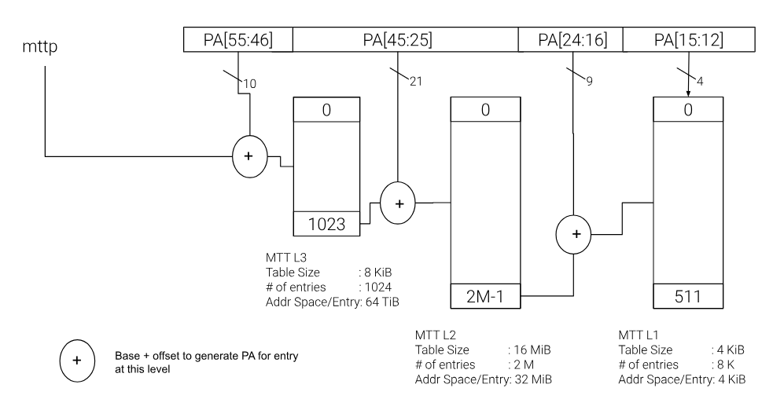
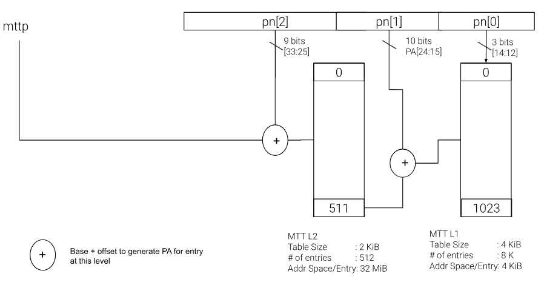

[[chapter4]]
[[Smmtt]]
== `Smmtt`: Hart MTT Extension

[[Smmtt-rw]]
=== Smmtt[34 | 46 | 56]

The Supervisor Physical Address (SPA) for RV32 and RV64 is shown below.
The MTT maps the SPA to read-write-execute access permissions.

[caption="Figure {counter:image}: ", reftext="Figure {image}"]
[title="RV32 Supervisor Physical Address", id=rv32-spa]
[wavedrom, ,svg]
....
{reg: [
  {bits:  12, name: 'page offset', attr: '12'},
  {bits:  3,  name: 'pn[0]',       attr: '3' },
  {bits:  10, name: 'pn[1]',       attr: '10' },
  {bits:  9,  name: 'pn[2]',       attr: '9'},
], config:{lanes: 1, hspace:1024}}
....

[caption="Figure {counter:image}: ", reftext="Figure {image}"]
[title="RV64 Supervisor Physical Address", id=rv64-spa]
[wavedrom, ,svg]
....
{reg: [
  {bits:  12, name: 'page offset', attr: '12'},
  {bits:  4,  name: 'pn[0]',       attr: '4' },
  {bits:  9,  name: 'pn[1]',       attr: '9' },
  {bits:  21, name: 'pn[2]',       attr: '21'},
  {bits:  10, name: 'pn[3]',       attr: '10'},
], config:{lanes: 1, hspace:1024}}
....

The `PPN` rooted structure for the MTT is shown below. <<mtt-map-rv64>>
specifies an RV64 supervisor physical address lookup and <<mtt-map-rv32>>
specifies an RV32 supervisor physical address lookup. Each physical-addressable
page is associated with an access-permission encoding. The supervisor physical
address (SPA) is used to index into the `MTT` structure in memory to lookup
access permissions for the supervisor domain specified via the MTT structures.
Intermediate `MTTL3` and `MTTL2` non-leaf entries are used to allow this
structure to be sparsely populated. The `MTTL3` table is not applicable for
physical address widths <= 46.

[caption="Figure {counter:image}: ", reftext="Figure {image}"]
[title= "`MTT` walk for RV64", id=mtt-map-rv64]

[caption="Figure {counter:image}: ", reftext="Figure {image}"]
[title= "`MTT` walk for RV32", id=mtt-map-rv32]

The following MTT L3 entry accomodates a 56 bit PAW:

[caption="Figure {counter:image}: ", reftext="Figure {image}"]
[title="`MTTL3` entry (XLEN=64 only)"]
[wavedrom, ,svg]
....
{reg: [
  {bits:  44, name: 'MTTL2 PPN'},
  {bits:   1, name: 'VALID'},
  {bits:  19, name: 'RESERVED'},
], config:{lanes: 1, hspace:1024}}
....

The `VALID` bit determines the validity of the `MTTL3` entry. If this bit is
set, the `MTTL3` entry is valid and the `MTTL2 PPN` holds the next level of the
MTT, and the `RESERVED` field must be 0. If the `VALID` bit is clear, the entry
is invalid, and all other bits in the entry are don't-cares and may be used
freely by software.

The following are the `MTTL2` entry by XLEN:

[caption="Figure {counter:image}: ", reftext="Figure {image}"]
[title="`MTTL2` entry (XLEN=64)"]
[wavedrom, ,svg]
....
{reg: [
  {bits:  44, name: 'INFO'},
  {bits:  3,  name: 'TYPE'},
  {bits:  17, name: 'RESERVED'},
], config:{lanes: 1, hspace:1024}}
....

[caption="Figure {counter:image}: ", reftext="Figure {image}"]
[title="`MTTL2` entry (XLEN=32)"]
[wavedrom, ,svg]
....
{reg: [
  {bits:  22, name: 'INFO'},
  {bits:  3,  name: 'TYPE'},
  {bits:  7,  name: 'RESERVED'},
], config:{lanes: 1, hspace:1024}}
....

The `RESERVED` field must always be 0.

The `TYPE` field determines the interpretation of the `MTTL2` entry. Unless
specified, the encodings are the same for RV32 and RV64. The `TYPE` field
encoding is as follows:

* 000b - `1G_disallow` - read, write or execute access is not allowed for the
          1 GiB range for the supervisor domain.
* 001b - `1G_allow_rx` - read and execute access for the 1 GiB range is allowed
          for the supervisor domain.
* 010b - `1G_allow_rw` - read and write access for the 1 GiB range is allowed
          for the supervisor domain
* 011b - `1G_allow_rwx` - read, write and execute access for the 1 GiB range is
          allowed for the supervisor domain
* 100b - `MTT_L1_DIR` - The 32 MiB range is composed of 8192 x 4 KiB pages.
* 101b - `4M_PAGES` (RV32) or `2M_PAGES` (RV64). For RV32, `4M_PAGES` specifies
          that the 32 MiB range is composed of 8 x 4 MiB pages. For RV64
         `2M_PAGES` specifies that the 32 MiB range is composed of 16 x 2 MiB
          pages.
* 110b - `Reserved` for future use and causes an access violation if used.
* 111b - `Reserved` for future use and causes an access violation if used.

The `INFO` field depends on the `TYPE` field and is formatted as per the
following table:

[[Smmtt-rw-l2-encoding]]
.`MTTL2` Entry Type for Smmtt
[width="100%",cols="25%,75%",options="header",]
|===
|*`MTTL2` Entry `TYPE`* |*Description, `INFO` and `TYPE` field encoding*
|`1G_disallow` a|
_read, write or execute is not allowed to this 1 GiB address range for the
domain._ The `INFO` field must be 0. When configuring 1 GiB ranges, RDSM must
ensure that 32 `MTTL2` entries, each corresponding to 32 MiB of address space,
have identical `TYPE` field values. If the 32 consecutive `MTTL2` entries
corresponding to this 1 GiB address range do not have identical `TYPE` field
values, it is unspecified which of these entries is used to determine the
permissions for this address range.

|`1G_allow_rx` a|
_read and execute (but no write) is allowed to this 1 GiB address range for the
domain._ The `INFO` field must be 0. When configuring 1 GiB ranges, RDSM must
ensure that 32 `MTTL2` entries, each corresponding to 32 MiB of address space,
have identical `TYPE` field values. If the 32 consecutive `MTTL2` entries
corresponding to this 1 GiB address range do not have identical `TYPE` field
values, it is unspecified which of these entries is used to determine the
permissions for this address range.

|`1G_allow_rw` a|
_read and write (but no execute) is allowed to this 1 GiB address range for the
domain._ The `INFO` field must be 0. When configuring 1 GiB ranges, RDSM must
ensure that 32 `MTTL2` entries, each corresponding to 32 MiB of address space,
have identical `TYPE` field values. If the 32 consecutive `MTTL2` entries
corresponding to this 1 GiB address range do not have identical `TYPE` field
values, it is unspecified which of these entries is used to determine the
permissions for this address range.

|`1G_allow_rwx` a|
_read, write and execute is allowed to this 1 GiB address range for the domain._
The `INFO` field must be 0. When configuring 1 GiB ranges, RDSM must ensure that
32 `MTTL2` entries, each corresponding to 32 MiB of address space, have
have identical `TYPE` field values. If the 32 consecutive `MTTL2` entries
corresponding to this 1 GiB address range do not have identical `TYPE` field
values, it is unspecified which of these entries is used to determine the
permissions for this address range.

|`MTT_L1_DIR` a|
The `INFO` field provides the PPN of the `MTTL1` page. Entries of the `MTTL1`
page hold XLEN/4 2-bit `PERM` fields for each 4 KiB page. MSB bits
XLEN-1:XLEN/2 of the `MTTL1` entry are reserved for future use. The 2-bit `PERM`
field holds access-permission for 4 KiB pages for the supervisor domain, as
described in <<mtt-l1-rv64>> for RV64 and <<mtt-l1-rv32>> for RV32.

|`4M_PAGES` a|
This encoding is specified as follows for RV32:
_The 32 MiB range of address space is partitioned into 8 4 MiB pages where each
page has read/write/execute access specified via the `INFO` field._
The `INFO` field holds 8 2-bit `PERM` access-encoding for each 4 MiB address
range to indicate: `no_access_allowed` (00b), `read-execute-allowed` (01b),
`read-write-allowed` (10b), `read-write-execute-allowed` (11b). Bits
_mpte.info[15:0]_ holds the 2 MiB page permissions, and _mpte.info[21:16]_ are
reserved and must be zero.

|`2M_PAGES` a|
This encoding is specifies as follows for RV64:
_The 32 MiB range of address space is partitioned into 16 2 MiB pages where each
page has read/write/execute access specified via the `INFO` field._
The `INFO` field holds 16 2-bit `PERM` access-encoding for each 2 MiB address
range to indicate: `no_access_allowed` (00b), `read-execute-allowed` (01b),
`read-write-allowed` (10b), `read-write-execute-allowed` (11b). Bits
_mpte.info[31:0]_ holds the 2 MiB page permissions, and _mpte.info[43:32]_ are
reserved and must be zero.
|===

The `MTTL1` table is populated if protection granularity of the 4 KiB page is
desired for the supervisor domain.

The `MTTL1` entry is XLEN wide and holds XLEN/4 number of 2-bit fields where
each field specifies the access-permissions for a 4 KiB page (with XLEN-1:XLEN/2
bits reserved for future use). The entry is selected by page.pn[1], and the
2-bit field in the entry is selected using page.pn[0]. See <<mtt-l1-rv64>> for XLEN = 64 and
<<mtt-l1-rv32>> for XLEN = 32. Thus, there are 2 `PERM` bits for each 4 KiB
page. The encoding of `PERM` is as follows:

[[Smmtt-rw-l1-encoding]]
.`MTTL1` Entry permission encoding
[width="100%",cols="25%,75%",options="header",]
|===
|*`MTTL1` Access-permission encoding* |*Description*
|00b a|
The entry specifies access to the 4 KiB address space is *not allowed* for the
domain.
|01b a|
The entry specifies *read* and *execute* (but *no write*) access is allowed
to the 4 KiB address space for the domain.
|10b a|
The entry specifies *read* and *write* (but *no execute*) access is allowed
to the 4 KiB address space for the domain.
|11b a|
The entry specifies *read*, *write* and *execute* access is allowed to the 4 KiB
address space for the domain.
|===

[caption="Figure {counter:image}: ", reftext="Figure {image}"]
[title="`MTTL1` entry (XLEN=64)", id=mtt-l1-rv64]
[wavedrom, ,svg]
....
{reg: [
  {bits:  2,  name: 'PERM'},
  {bits:  28, name: '...'},
  {bits:  2,  name: 'PERM'},
  {bits:  32, name: 'resv'},
], config:{lanes: 1, hspace:1024}}
....

[caption="Figure {counter:image}: ", reftext="Figure {image}"]
[title="`MTTL1` entry (XLEN=32)", id=mtt-l1-rv32]
[wavedrom, ,svg]
....
{reg: [
  {bits:  2,  name: 'PERM'},
  {bits:  12, name: '...'},
  {bits:  2,  name: 'PERM'},
  {bits:  16,  name: 'resv'},
], config:{lanes: 1, hspace:1024}}
....

=== MTT access permissions lookup process

MTT access-permissions for a physical address PA in the context of a
supervisor domain are ascertained as follows:

1. Let _a_ be `mttp.ppn` x PAGESIZE, and let _i_ = LEVELS, where for mode
`Smmtt34`, LEVELS = 2 and for `Smmtt[46 | 56]`, LEVELS = 3; PAGESIZE
is 2^12^; MTT_PTE_SIZE = 8 bytes (for RV32, MTT_PTE_SIZE = 4 bytes). The `mttp`
register must be active, i.e., the effective privilege mode must not be M-mode.

2. If _pa_ is greater than maximum-addressable physical address under the
current MTT mode, or is greater than a platform-defined maximum-addressable
physical address for the hart, then stop and raise an access-fault exception
corresponding to the original access type.

3. Let _mpte_ be the value of the `MTT` table entry at address _a_ + _pa.pn[i]_
 x MTT_PTE_SIZE. If accessing _mpte_ violates a PMA or PMP check, raise
an access-fault exception corresponding to the original access type.

4. If any bits or encodings that are reserved for future standard use are
set within _mpte_, or _mpte_ is a not-valid `MTTL3` entry, stop and raise an
access-fault exception corresponding to the original access type.

5. Otherwise, the _mpte_ is valid. If (_i_=1) or (_i_=2 and _mpte.type_ is not
`MTT_L1_DIR`), go to step 6. Otherwise, the _mpte_ is a pointer to the next
level of the `MTT`. Let _i_ = _i_-1. Let _a_ = _mpte.ppn_ x PAGESIZE and go to
step 3. Note that when _mpte.type_ = `MTT_L1_DIR`, the _mpte.ppn_ is the value
of the _mpte.info_ field.

6. A leaf _mpte_ has been found. If any bits or encodings within _mpte.type_
and _mpte.info_ that are reserved for future standard use, per
<<Smmtt-rw-l2-encoding>>, are set within _mpte_, stop and raise an access-fault
exception corresponding to the access type.

7. The _mpte_ is a valid leaf _mpte_. Fetch the access-permissions for the
physical address per the steps described below:

* if _i_=2, and the _mpte.type_ field directly specifies the access-permissions
for 1 GiB page regions (via 32 MTTL2 entries with identical _mpte.type_ values -
see <<Smmtt-rw-l2-encoding>>); go to step 8, else

* if _i_=2, and for XLEN = 64 and the _mpte.type_ field value `2M_PAGES`, the
_mpte.info_[31:0] field contains 16 entries of 2-bit access-permission encodings
for 16 2 MiB address regions; For XLEN=32 and _mpte.type_ field value of
`4M_PAGES`, the _mpte.info_[16:0] field contains 8 entries of 2-bit
access-permission encodings for 8 4 MiB regions - see <<Smmtt-rw-l2-encoding>>;
go to step 8, else

* if _i_=1, the _mpte_ contains XLEN/4 2-bit entries that hold access-permission
encodings for 4 KiB pages. The entry is selected by _pa.pn[0]_. The LSB
XLEN/2-1:0 bits holds 2-bit encodings within the entry to specify the
access-permission encoding for the _pa_. The MSB XLEN-1:XLEN/2 bits are
reserved.The encodings are specified in <<Smmtt-rw-l1-encoding>>.

8. Determine if the requested physical memory access is allowed per the
access-permissions. If access is not permitted, stop and raise an access-fault
exception corresponding to the original access type.

9. The access is allowed per the `MTT` lookup.

All implicit accesses to the memory tracking table data structures in
this algorithm are performed using width MTT_PTE_SIZE.

[NOTE]
====
Restricting the _pa_ (in step 2) to the maximum-addressable PA width supported
by a platform allows for optimizing memory requirements of the MTT structures
such as the MTTL2 and MTTL3 entry tables, when the PA width is not 34, 46, or 56
bits.
====

[NOTE]
====
MTT access-permissions can only further restrict access, and never grant
read, write or execute permission denied by 1st-stage or G-stage translations.
====

=== Access Enforcement and Fault Reporting

As shown in <<mtt-lookup>>, and described in the MTT lookup process,
MTT lookup composes with, but does not require,
page-based virtual memory (MMU, IOMMU) and physical memory protection mechanisms
(PMP, Smepmp, IOPMP). When paging is enabled, instructions that access virtual
memory may result in multiple physical-memory accesses, including (implicit
S-mode) accesses to the page tables. MTT checks also apply to these implicit
S-mode accesses - those accesses will be treated as reads for translation and as
writes when A/D bits are updated in page table entries when `Svadu` is
implemented.

MTT is checked for all accesses to physical memory, unless the effective privilege
mode is M, including accesses that have undergone virtual to physical memory
translation, but excluding implicit MTT checker accesses to MTT structures. Data accesses
in M-mode when the MPRV bit in mstatus is set and the MPP field in mstatus contains S
or U are subject to MTT checks. MTT checker accesses to MTT structures are to be
treated as implicit M-mode accesses and are subject to PMP/Smepmp and
IOPMP checks. Implicit accesses to the MTT are governed by `mstatus.MBE` control
for RV64 and `mstatush.MBE` control for RV32. The MTT checker indexes the MTT using the
physical address of the access to lookup and enforce the access permissions.
A mismatch of the access type and the access permissions specified in the
MTT entry that applies to the accessed region is reported as a trap to the
RDSM which may report it to a supervisor domain. To enable composing
with Sv modes, the MTT supports configuration at supported architectural
page sizes. MTT violations manifest as instruction, load, or store access-fault
exceptions. The exception conditions for MTT are checked when the access
to memory is performed.

=== Caching of MTT and Supervisor Domain Fence Instruction

<<mfence-spa>> describes the canonical behavior of the `MFENCE.SPA` instruction
to invalidate cached access-permissions for all supervisor domains, a specific
supervisor domain, or a specific physical address for a supervisor domain.

<<minval-spa>> implemented with `Sinval` describes a finer granular invalidation
of access-permission caches.

When `Smmtt` is implemented, an `MTT` structure is used to specify
access-permissions for physical memory for a supervisor domain, the `MTT`
settings for the resulting physical address (after any address translation) may
be checked (and possibly cached) at any point between the address translation
and the explicit memory access. Therefore, when the `MTT` settings
are modified, `M-mode` software must synchronize the cached `MTT` state with the
virtual memory system and any `PMP`, `MTT` or address-translation caches, as
described via <<mfence-spa>> or in a batched manner via <<minval-spa>>.

When used with the `MTT`, the `MFENCE.SPA` is used to synchronize updates to
in-memory MTT structures with current execution. `MFENCE.SPA` in this case,
applies only to the memory tracking table data structures controlled by the
CSR `mttp`. Executing a `MFENCE.SPA` guarantees that any previous stores already
visible to the current hart are ordered before all implicit reads by that hart
done for the `MTT` for non- `M-mode` instructions that follow the `MFENCE.SPA`.

When `MINVAL.SPA` is used, access-permission cache synchronization may be
batch optimized via the use of the sequence `SFENCE.W.INVAL`, `MINVAL.SPA` and
`SFENCE.INVAL.IR`.

[NOTE]
====
MTT lookups that began while `mttp` was active are not required to complete or
terminate when `mttp` is no longer active, unless a `MFENCE.SPA` instruction
matches the `SDID` (and optionally, `PADDR`) is executed. The `MFENCE.SPA`
instruction must be used to ensure that updates to the `MTT` data structures are
observed by subsequent implicit reads to those structures by a hart.
====

If `mttp.MODE` is changed for a given SDID, a `MFENCE.SPA` with rs1=x0 and rs2
set either to x0 or the given SDID, must be executed to order subsequent PA
access checks with the `MODE` change, even if the old or new `MODE` is `Bare`.
