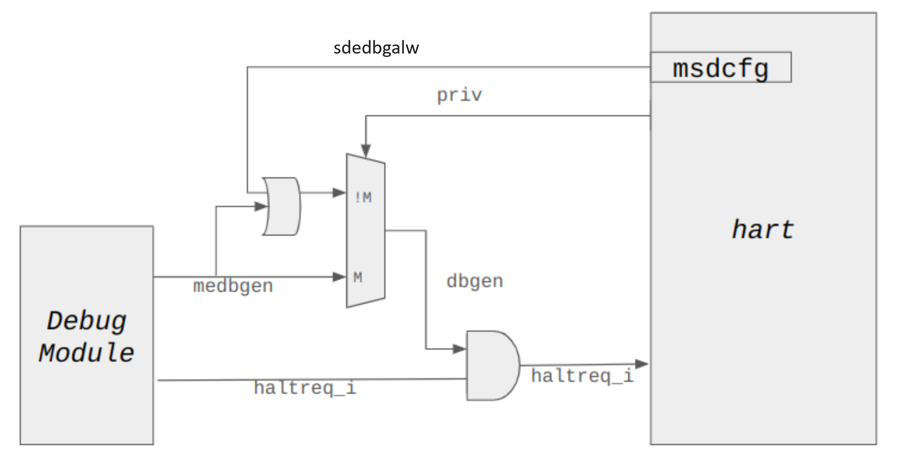

[[chapter8]]
[[Smsdedbg]]
== Supervisor Domain External Trace and Debug

This chapter describes two extensions `Smsdedbg` and `Smsdetrc` that enable a
RDSM to manage isolation of supervisor domains when external debug and trace
mechanisms are being utilized. `Smsdedbg` defines the `sdedbgalw` bit in the
<<MSDCFG>> CSR that specifies if a supervisor domain is allowed to be
externally-debugged. Similarly, `Smsdetrc` defines the `sdetrcalw` bit in the
<<MSDCFG>> CSR that specifies if a supervisor domain is allowed to be
externally-traced cite:[ExtDbg]. External trace refers to tracing software
running on a separate target RISC-V platform, via a trace control/data transport
that provides external access to the trace encoder controls cite:[ETrc]. These
two extensions only affect debug and trace orchestrated by an external actor -
self-hosted debug (and trace) are managed directly by the RDSM. This chapter
refers to the Debug specification cite:[ExtDbg], Trace specification
cite:[ETrc], and the External debug security extension cite:[ExtDbgSec] for the
description and behavior of controls outside the scope of this specification,
but which interact with controls specified in this specification when one or
more supervisor domains are used. Note that `Smsdedbg` and `Smsdetrc` may be
used as independent extensions even when a single supervisor domain is being
utilized on a platform.

[NOTE]
====
The configuration for `msdcfg.sdedbgalw` and `msdcfg.sdetrcalw` is expected to
be obtained from the manifest/configuration of the supervisor domain and
reported in the attestation report for the supervisor domain and it's workloads.
The RDSM should manage this supervisor domain configuration state for context
switching using secure memory.
====

=== `Smsdedbg`: External Debug allowed control for Supervisor Domain

When M-mode external debug is enabled, all supervisor domains may also be
debugged by an external debugger irrespective of the configuration held in
`msdcfg.sdedbgalw`.

When M-mode external debug is disabled, whether execution at privilege modes
less than `M-mode` may be debugged by an external debugger depends on the
configuration held in `msdcfg.sdedbgalw`, as described below:

When `msdcfg.sdedbgalw` = 0, external debug is disallowed for the supervisor
domain. Abstract commands and halt request from the debug module are suppressed
and stay pending while the supervisor domain is active, on a per-hart basis.
Other debug operations (current or defined in the future) must similarly be kept
pending while the supervisor domain is active on a hart. Triggers for the
supervisor domain must be controlled by the RDSM to prevent any leakage of
information across security domains.

When `msdcfg.sdedbgalw` = 1 then external debug of privilege modes less than
`M-mode` is allowed for such a supervisor domain on a per-hart basis. +

To enforce the above controls specified by this extension, the following
functional and security requirements must be met by the external secure debug
system cite:[ExtDbgSec] to meet the security objectives of supervisor domain
isolation:

. The enable control for external debug driven by the external debug module is
  expected to be established by the platform root-of-trust following RISC-V
  Security Model recommendations SR_GEN_007 and SR_GEN_012. When the control is
  in cleared state, the hart should not be able to enter external debug.
. External debug must be able to transition the hart to Debug Mode and access
  supervisor domain memory and state. In this context, "state" includes all
  non-M-mode resources accessible per the Debug specification cite:[ExtDbg].
. Triggers must match and fire on a hart only when a supervisor domain with this
  configuration is active on a hart (and not in M-mode).
. The RDSM must be able to context switch all triggers even when `d-mode` = 1.
  This functional change allows the RDSM to remain in control of external debug
  for supervisor domains when it is not under external debug itself.

The following figure is non-normative and is intended to illustrate the use of
the `msdcfg.sdedbgalw` control - the normative specification will be in the
specification for external debug security cite:[ExtDbgSec].

[caption="Figure {counter:image}: ", reftext="Figure {image}"]
[title= "External Debug opt-in for Supervisor Domain", id=Smsdedbg_img]

=== `Smsdetrc`: External Trace allowed control for Supervisor Domain

When M-mode external trace is enabled, all supervisor domains activity may also
be traced by an external trace tool irrespective of the configuration held in
`msdcfg.sdetralw`.

When M-mode external trace is disabled, whether execution at privilege modes
less than `M-mode` may be traced by an external trace tool depends on the
configuration held in `msdcfg.sdetrcalw`, as described below:

When `msdcfg.sdetrcalw` = 0, external trace is disallowed for the SD. All trace
output from the trace encoder module are disabled while the SD is active on a
per-hart basis.

When `msdcfg.sdetrcalw` = 1 then external trace of privilege modes less than
`M-mode` shall be allowed for the SD on a per hart basis.

To enforce the above controls specified by this extension, the following
functional and security requirements must be met by the external secure debug
system cite:[ExtDbgSec] to meet the security objectives of supervisor domain
isolation:

. The enable control for external trace driven by the external trace module is
  expected to be established by the platform root-of-trust following RISC-V
  Security Model recommendations SR_GEN_007 and SR_GEN_012. When the control is
  in cleared state, the hart should not be able to generate trace.
. Per the Efficient trace specification cite:[ETrc], the side-band `halted`
  signal being asserted, stops subsequent tracing from the hart. On this signal
  being deasserted, the encoder can start tracing again. Implementation of this
  `halted` side-band signal is required to support external tracing with
  supervisor domains. The state of the `halted` side-band signal shall be gated
  by the external tracing enable control for M-mode.
. When external tracing is disabled, tracing should be stopped (via asserting
  `halted`) on:
.. entry to Debug mode
.. entry to `M-mode` privilege
.. entry to privilege less than `M-mode` with `msdcfg.sdetrcalw` = 0.
. When extracing tracing is disabled, tracing should be started (via deasserting
  `halted`) on:
.. Entry to privilege less than `M-mode` with `msdcfg.sdetrcalw` = 0

When external tracing is enabled (and authorized), there are no restrictions and
all privilege modes (inclusive of `M-mode` and any supervisor domains managed by
the RDSM) are traceable. In this case, tracing shall be enabled (via asserting
`halted`) on entry to Debug mode, and stopped on resumption from Debug Mode.
