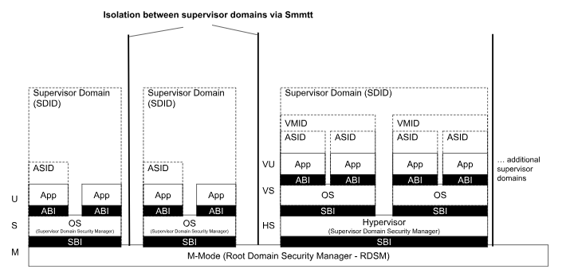
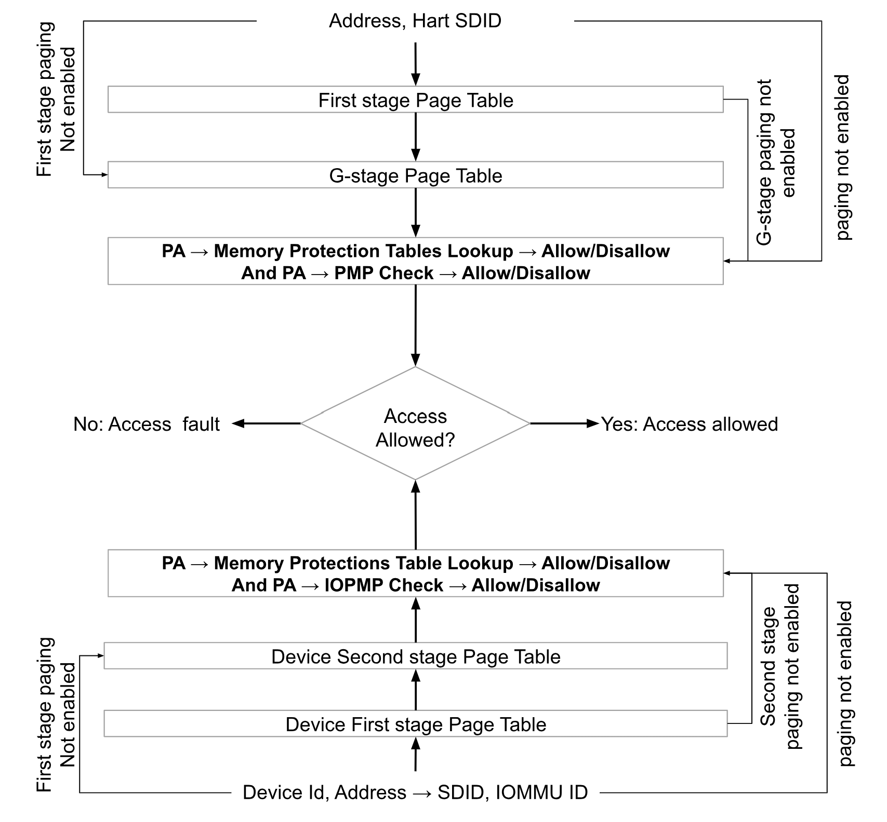

[[intro]]

== Introduction

=== Motivation and Goals

RISC-V privileged architecture cite:[ISA] defines execution mode for supervisor
software called S-mode. S-mode software may optionally enable Hypervisor
extension to host virtual machines. Typically, there is a single supervisor
domain of execution with access to all physical memory. This document describes
*Supervisor Domain Access Protection* - a RISC-V privileged architecture
extension to support physical address space (memory and devices) isolation for
more than one supervisor domain. Supervisor domains enable trusted execution
use cases for RISC-V platforms. Supervisor domains may also be used to reduce
the supervisor Trusted Computing Base (TCB), with differential access to memory
and other platform resources e.g. in Confidential Computing, TEE Security
Services, Secure Devices etc.

Tenant (application or VM) workloads on multi-tenant platforms rely on
hardware-based isolation primitives that are managed by the host/privileged
software. Traditional host software (operating systems and virtual machine
monitors) have unfettered access to system memory, devices and hardware
isolation mechanisms such as the memory management unit (MMU) or physical
memory protection (PMP) registers. Typical multi-tenant platforms also have a
very large Trusted Computing Base (TCB) and have many threat actors that
influence the TCB. For example, in a multi-tenant data-center environment, the
host software, devices and device drivers, cloud operators, orchestration
services, other tenant workloads etc. are all considered threat vectors.
Additional threats originate due to deployment models, for example, an embedded
platform deployed in the field is exposed to physical threat vectors. Hence, in
many scenarios isolated supervisor domains are desired to be able to express
differentiated trust models and secure access to platform resources. A
supervisor domain uses resources (such as memory/IO regions, processing
elements, devices and interrupts) to perform their function.

[caption="Figure {counter:image}: ", reftext="Figure {image}"]
[title= "Supervisor Domains"]

A supervisor domain is associated with a set of physical address regions that
are isolated from other supervisor domains on the same platform, with only the
Root Domain Security Manager (RDSM) with access to all of the physical address
space. A supervisor domain identifier (SDID) is associated with the hart
operating in the context of a supervisor domain to facilitate physical address
protection fences on a per supervisor domain basis. Supervisor domains must rely
on a TCB which consists of the RDSM (software) and hardware (hart, SoC,
Root-of-trust) that enforces the isolation properties for the supervisor domain.
The RDSM may utilize PMP/ `Smepmp` and/or the `Smmpt` (Machine-level Memory
Protection Tables)
extension described in this specification to isolate physical memory between
supervisor domains. Isolation of the workloads within a supervisor domain is the
responsibility of the OS/hypervisor managing the supervisor domain, here
referred to as the Supervisor Domain Security Manager (SDSM).

A key goal of using multiple domains is to be able to reduce the common TCB
across domains, and should enable the attestation cite:[CCC] of each domain
independently from other domains. Sensitive data may be entrusted to a
particular domain after verifying the trust properties statically (via boot) or
dynamically (via attestation). These trust properties are established as part
of the hardware and software supply chain, system configuration and may be
additionally evaluated using attestation mechanisms. The security certification
of the RDSM is desirable but out of scope of this specification.

Use cases for supervisor domain isolation range from embedded to
application/server-class platforms. Some examples where supervisor domains can
be used are:

* A trusted execution environment domain that isolates security
services/applications.
* A confidential computing cite:[CCC] domain which enforces confidentiality and
integrity for workload data-in-use from the host/untrusted hypervisor, along
with attestation of the TCB.
* A host (operator) domain that manages resources on the platform, and may
assign resources to other domains.
* A service-provider domain that has exclusive access to some devices.

In order to avoid re-factoring of deployed software, workloads and
applications, new hardware primitives are required to support flexible isolation
of data in caches and memory. The new primitives are also required to isolate
resources such as interrupts, IO, QoS mechanisms and debug/trace mechanisms for
robust isolation of supervisor domains. The hardware primitives must support
performant and scalable physical memory isolation at a page-level to support
rich-OS memory management models. This specification describes the set of
architecture extensions to support the requirements for supervisor domain
isolation for RISC-V processor-based platforms.

=== Memory Isolation - Theory of operation (informative)

Supervisor Domain Access Protection extensions are used by M-mode RDSM to
program access policies for supervisor domain operation. The `Smmpt` extension
enables the RDSM to program permissions for physically-addressed memory (or
device-mapped regions) by a hart/device operating within a supervisor domain.
Associating a hart/device with a supervisor domain implies that any
physical-addressable region access occurring in the context of the supervisor
domain is subject to access-checks for that domain. Hence, software or hardware
accesses that originate from supervisor domains other than the allowed
supervisor domain can be explicitly prevented/allowed. The RDSM has access to
physical memory for all supervisor domains. In typical security usages, write
accesses to the MPT structures must be restricted and managed by the RDSM.

Memory regions may be accessed by harts or by other devices on the platform.
When harts and devices are assigned to a supervisor domain, the hart/device is
said to perform memory accesses in the context of that supervisor domain. For
all accesses using a physical address, the SDID is the supervisor domain
identifier programmed into a CSR.  This CSR is programmed on the hart by the
Root Domain Security Manager (RDSM). The assignment of the hart/device to a
supervisor domain may be static (e.g. device assignment to a VM) or dynamic
(e.g. scheduling a VM virtual cpu within a domain). The MPT for the supervisor
domain active on the hart is programmed on the hart along with the supervisor
domain identifier. The MPT does not perform any address translation; it simply
provides access permissions for the physically addressed regions/pages
to enforce the isolation properties per the use case requirements (see
<<mpt-lookup>> for a high-level illustration and section <<Smmpt>> for
normative details).

[caption="Figure {counter:image}: ", reftext="Figure {image}"]
[title= "MPT lookup for Supervisor Domain Access", id=mpt-lookup]

The MPT checker is a functional block that looks up the `MPT` using the physical
address of the access as an index to retrieve the access permissions for the
supervisor domain. This checker thus enforces that for a load initiated by the
hart, the physical address is readable, and for a store initiated by the hart,
the physical address is also writable, else reports a fault. An MPT access
violation is always reported as a trap to the `M-mode` RDSM. The MPT checker may
be implemented as an MMU extension in the hart, and/or in the IO interconnect to
check device accesses. The MPT checker is designed to work together with the
page-based virtual memory (MMU, IOMMU) systems and Physical Memory Protection
(`PMP`, `Smepmp`, `IOPMP`) mechanisms. Read and Write permissions for memory are
derived from the page table, the `PMP` and the `MPT` - an access is allowed only
when all protection mechanisms allow the access.

MPT may be used to provide permissions for physical memory addresses
that hold regular main memory or IO memory. Memory may be assigned to
the RDSM to bootstrap the subsequent run-time lookup structures for MPT.
All memory should be covered by the MPT, though some memory may not be
eligible to be qualified for assignment to a specific supervisor domain.
This limitation may arise due to platform configuration and security
policies - for example, if the platform security policy requires memory
for a domain to be encrypted and some memory access paths are not
enforced via an inline memory encryption engine. It is expected that the
RDSM can use trusted platform-specific methods to enumerate which
regions can be designated as access-controlled via the MPT.

MPT must support both static and run-time configurability. A memory
region (consisting of one or more pages) may be (re)assigned from one
domain to another at run-time e.g. this is done by revoking the
permission for one domain and assigning permissions to another domain.
Run-time configuration may be performed via M-mode CSRs and/or in-memory
structures. The in-memory structures used for MPT must themselves be
access-limited to the RDSM by use of the MPT structures to disallow any
supervisor domain from accessing the structures unless explicitly
delegated by the Root Domain Security Manager (RDSM) to a particular
domain (per use case policies). To support MPT dynamic reconfiguration,
an interface is expected to be provided to set the attributes by passing
requests to a trusted driver (in the RDSM) that can reconfigure the
memory region assignment. Converting memory regions assignment from one
domain to another might involve platform-specific operations based on
the enforcement mechanism, such as TLB/cache flushes, that must be
enforced by the RDSM and hardware. The RDSM is expected to change the
settings and flush caches if necessary, so the system is only incoherent
during the transition between domain assignment settings. This
transitory state should not be visible to lower privilege levels (i.e.
supervisor domains). There are also security aspects to be considered during
(re)configuration, e.g., clearing memory used by the current SD before
assigning it to another SD. Refer to the RISC-V CoVE cite:[CoVE] ABI and threat
model as a reference.

A hart/device may perform accesses to memory exclusively accessible to its
supervisor domain, or to memory shared globally with one or more supervisor
domains. Memory sharing between supervisor domains is achieved by simply making
the physical memory region accessible to the supervisor domains via the MPT
structure associated with the hart or device. Access to physical addresses
initiated from a hart or a device assigned a supervisor domain identifier may be
denied by virtue of the permissions in the MPT lookup - such disallowed accesses
from a hart cause a trap to the RDSM to report a fault. In the case of a device
access disallowed by the MPT, the IO sub-system may log an error for the RDSM
which may delegeate it to a supervisor domain.

The intra-domain isolation of memory between two harts/devices belonging
to the same supervisor domain, but different tenant workloads, may be
achieved via the use of MMU, PMP/Smepmp, SPMP, IOMMU and IOPMP depending on the
type of platform and the type of access. To successfully achieve this
isolation, the page table structures for a domain's workloads must be
managed by the Supervisor Domain Security Manager (SDSM) and the paging
structures must be located in memory exclusively-accessible only to the
supervisor domain. Additional security properties may be enforced based
on type (data fetch, instruction fetch, etc.) and locality (hart
supervisor domain identifier) of memory accesses as required for the
security policy specific to usages. An example policy may be to require
certain accesses to target only exclusively-owned domain memory. The MPT
checker may utilize the supervisor domain identifier or additional metadata
for the access to enforce such policies. The description of different types
of supervisor domain policies possible is outside the scope of this document.

Additional protection/isolation for memory associated with a supervisor domain
is orthogonal (and usage-specific). Such additional protection for memory may
be derived by the use of cryptography and/or access-control mechanisms. The
mechanisms chosen for these additional protection methods are independent of
`Smmpt` and may be platform-specific. The TCB of a particular supervisor domain
(and devices that are bound to it) may be independently evaluated via
attestation of the HW and SW TCB by a relying party using standard Public-Key
Infrastructure-based mechanisms.

