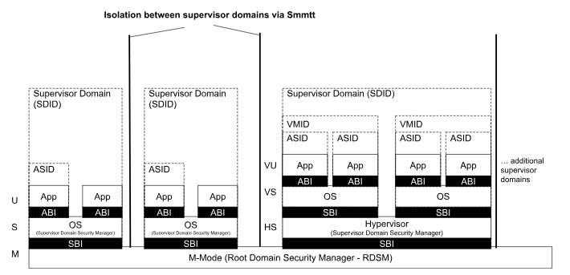
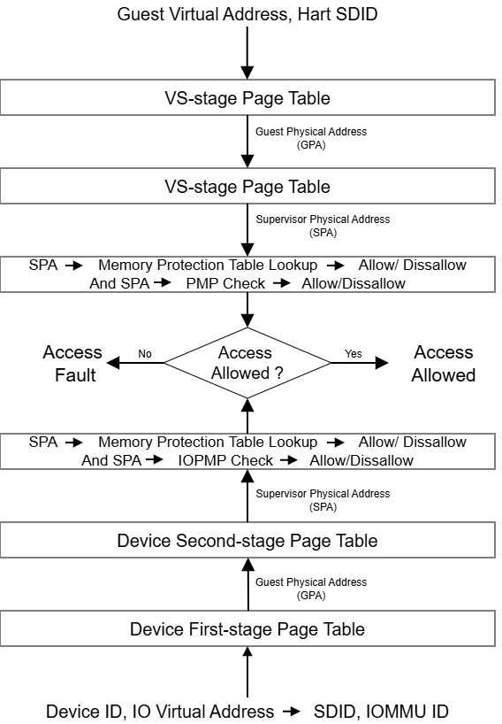

[[intro]]

== Introduction

=== Motivation and Goals

RISC-V privileged architecture cite:[ISA] defines an execution mode for supervisor
software known as S-mode, for operating systems and other supervisor-level software. 
Implementations may optionally support the Hypervisor extension, enabling S-mode software 
to host and manage virtual machines. Traditionally, supervisor software is granted access 
to the entire physical address space, including memory, devices, and platform control resources,
except that reserved by and for M-mode use. Physical Memory Protection (PMP) can be used to restrict 
S-mode access to selected resources and to isolate one set of S-mode resources from another, thereby 
creating isolated supervisor domains. However, because of the practical limit on the number of PMP 
entries, and the complexity and overhead associated with dynamically reprogramming PMP configurations, 
this approach is typically suitable only for simple systems with statically allocated resources. 

This document defines *Supervisor Domain Access Protection (SDAP)*, and the set of RISC-V privileged 
architecture extensions that enable the partitioning of platform resources among multiple 
isolated supervisor domains. A supervisor domain is allocated a set of resources—including 
memory and I/O regions, processing elements, devices, and interrupts—and is granted access only
to those resources required to perform its function. 

Supervisor domains enable trusted-execution use cases by establishing independent trust boundaries 
within a system. They allow the platform Trusted Computing Base (TCB) to be decomposed into smaller, 
function-specific components with access only to the resources they require. This capability is 
applicable to use cases including Confidential Computing, Trusted Execution Environments (TEEs), 
security services, and secure-device management.

In Confidential Computing deployments, trust boundaries are defined by supervisor domains rather 
than solely by privilege levels. Software executing with higher privilege in one supervisor domain 
is not implicitly trusted by, and should not have access to, the resources assigned to another 
supervisor domain. This enables confidential workloads to remain isolated from privileged software 
outside their trust boundary and limits the impact of software compromise in other domains

Multi-tenant platforms rely on hardware-enforced isolation mechanisms managed by privileged 
software. Conventional operating systems and virtual machine monitors typically have unrestricted 
access to system memory, devices, and isolation controls such as the Memory Management Unit (MMU) 
and Physical Memory Protection (PMP) registers. As a result, they form a large TCB and represent a 
significant concentration of trust.

In many deployment scenarios, additional parties may influence the security of the system, including 
host software, device drivers, cloud operators, orchestration services, and other tenant workloads. 
Embedded systems may also face physical attack threats. Consequently, many use cases require isolated 
supervisor domains to express distinct trust relationships and to enforce secure, differentiated access 
to platform resources.

[caption="Figure {counter:image}: ", reftext="Figure {image}"]
[title= "Supervisor Domains"]

A supervisor domain is associated with a set of physical address regions that
are isolated from other supervisor domains on the same platform, set up by M-mode software
known as a Root Domain Security Manager (RDSM).  The RDSM is all the M-mode firmware responsible 
for managing supervisor domains, and has access to all of the physical address
space. A supervisor domain identifier (SDID) is associated with the hart
operating in the context of a supervisor domain to facilitate physical address
protection on a per supervisor domain basis. Supervisor domains must rely
on a TCB which consists of the RDSM (software) and hardware (hart, SoC,
Root-of-trust) that enforces the isolation properties for the supervisor domain.
The RDSM may utilize `Smepmp` (Extended M-mode Physical Memory Protection Registers) - or equivalent 
and/or the `Smmpt` (Machine-level Memory Protection Tables, MPT) 
extension described in this specification to isolate physical memory between
supervisor domains. Memory Protection Tables are memory-resident data structures that encode the 
physical memory permissions map for a given supervisor domain.  Typically, implementations would 
cache MPT data in a TLB-like structure . 
Isolation of the workloads within a supervisor domain is the
responsibility of the OS/hypervisor managing the supervisor domain, here
referred to as the Supervisor Domain Security Manager (SDSM).

A key goal of using multiple domains is to be able to reduce the common TCB
across domains, and should enable the attestation cite:[CCC] of each domain
independently from other domains. Sensitive data may be entrusted to a
particular domain after verifying the trust properties statically (via boot) or
dynamically (via attestation). These trust properties are established as part
of the hardware and software supply chain, system configuration and may be
additionally evaluated using attestation mechanisms. The security certification
of the RDSM is desirable but out of scope of this specification.

Use cases for supervisor domain isolation range from embedded to
application/server-class platforms. Some examples where supervisor domains can
be used are:

* A trusted execution environment domain that isolates security
services/applications.
* A confidential computing cite:[CCC] domain which enforces confidentiality and
integrity for workload data-in-use from the host/untrusted hypervisor, along
with attestation of the TCB.
* A host (operator) domain that manages resources on the platform, and may
assign resources to other domains.
* A service-provider domain that has exclusive access to some devices.

In order to avoid re-factoring of deployed software, workloads and
applications, this proposal adds new hardware primitives required to support flexible isolation
of data in caches and memory. The new primitives are also required to isolate
resources such as interrupts, IO, QoS mechanisms and debug/trace mechanisms for
robust isolation of supervisor domains. The hardware primitives must support
performant and scalable physical memory isolation at a page-level to support
rich-OS memory management models. 

=== Memory Isolation - Theory of operation (informative)

Supervisor Domain Access Protection extensions are used by the RDSM to
program access policies for supervisor domain operation. The `Smmpt` extension
enables the RDSM to program permissions for physically addressed memory (or
device mapped regions) by a hart/device operating within a supervisor domain.
When supervisor domains are enabled on a hart , all physical memory accesses 
from privilege modes lower than M-mode are subject to access-checks for that domain. 
A device context may also be assigned to a supervisor domain with all device accesses checked for that domain.
In typical security deployments, write access to Memory Protection Table (MPT) structures is restricted to M-mode 
and managed exclusively by the RDSM.

Memory regions may be accessed by harts or by other devices on the platform.
When harts and devices are operating within a supervisor domain, the hart/device is
said to perform memory accesses in the context of that supervisor domain. The supervisor domain of a hart 
is programmed into a CSR by the RDSM. Devices have memory-mapped control registers to set the supervisor 
domain of each device context. The assignment of the hart/device to a
supervisor domain may be static (e.g. device assignment to a VM) or dynamic
(e.g. scheduling a VM virtual cpu within a domain). The MPT for the supervisor
domain active on the hart is programmed on the hart along with the supervisor
domain identifier. The MPT does not perform any address translation; it simply
provides access permissions for the physically addressed regions
to enforce the isolation properties per the use case requirements (see
<<mpt-lookup>> for a high-level illustration and <<Smmpt>> for
normative details).

[caption="Figure {counter:image}: ", reftext="Figure {image}"]
[title= "MPT lookup for Supervisor Domain Access", id=mpt-lookup]

The MPT checker is a functional block that looks up the `MPT` using the physical
address of the access as an index to retrieve the access permissions for the
supervisor domain. This checker thus enforces that for a load initiated by the
hart, the physical address is readable, and for a store initiated by the hart,
the physical address is writable, else reports a fault. An MPT access
violation is always reported as a trap to the `M-mode` RDSM. The MPT checker 
is designed to work together with the page-based virtual memory (MMU, IOMMU) 
systems and Physical Memory Protection (`PMP`, `Smepmp`, `IOPMP`) mechanisms. 
An access is allowed only when all protection mechanisms allow the access.

MPT may be used to provide permissions for physical memory addresses
that hold regular main memory or IO memory. Some memory may not be
eligible for assignment to a specific supervisor domain.
This limitation may arise due to platform configuration and security
policies - for example, if the platform security policy requires memory
for a domain to be encrypted and some memory access paths are not
protected via an inline memory encryption engine. It is expected that the
RDSM can use trusted platform-specific methods to enumerate which
regions can be designated as access-controlled via the MPT.

MPT can support both static and run-time configurability. A memory
region (consisting of one or more pages) may be (re)assigned from one
domain to another at run-time e.g. this is done by revoking the
permission for one domain and assigning permissions to another domain.
Run-time configuration may be performed via M-mode CSRs and/or in-memory
structures. The in-memory structures used for MPT must themselves be
access-limited to the RDSM by use of the MPT structures to disallow any
supervisor domain from accessing the structures unless explicitly
delegated by the Root Domain Security Manager (RDSM) to a particular
domain (per use case policies). To support MPT dynamic reconfiguration,
an interface is expected to be provided to set the attributes by passing
requests to a trusted driver (in the RDSM) that can reconfigure the
memory region assignment. Converting memory regions' assignment from one
domain to another might involve platform-specific operations based on
the enforcement mechanism, such as TLB/cache flushes, that must be
enforced by the RDSM and hardware. The RDSM is expected to change the
settings and flush caches if necessary, so the system is only incoherent
during the transition between domain assignment settings. This
transitory state should not be visible to lower privilege levels (i.e.
supervisor domains). There are also security aspects to be considered during
(re)configuration, e.g., clearing memory used by the current SD before
assigning it to another SD. Refer to the RISC-V CoVE cite:[CoVE] ABI and threat
model as a reference.

Memory sharing between supervisor domains is achieved by simply making
the physical memory region accessible to the supervisor domains via the MPT
structure associated with the hart or device. Access to physical addresses
initiated from a hart or a device assigned a supervisor domain identifier may be
denied by virtue of the permissions in the MPT lookup - such disallowed accesses
from a hart cause a trap to the RDSM to report a fault. In the case of a device
access disallowed by the MPT, the IO sub-system may log an error for the RDSM
which may delegate error handling to a supervisor domain.

Additional protection/isolation for memory associated with a supervisor domain
is orthogonal (and usage-specific). Such additional protection for memory may
be derived by the use of cryptography and/or access-control mechanisms. The
mechanisms chosen for these additional protection methods are independent of
`Smmpt` and may be platform-specific. The TCB of a particular supervisor domain
(and devices that are bound to it) may be independently evaluated via
attestation of the HW and SW TCB by a relying party using standard Public-Key
Infrastructure-based mechanisms.

